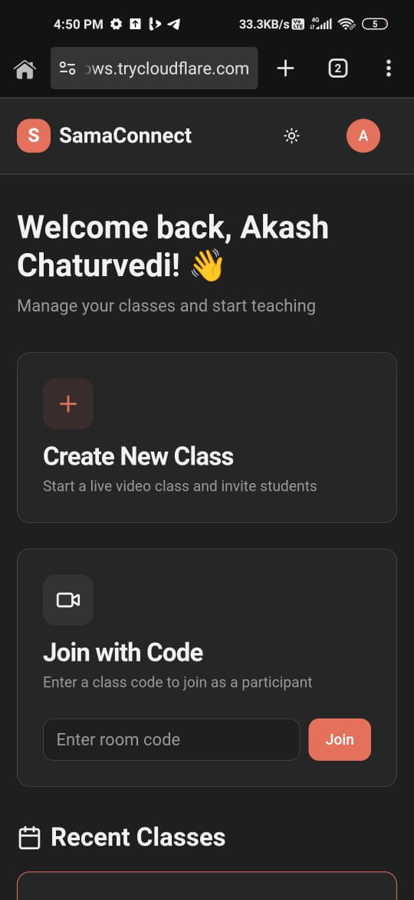
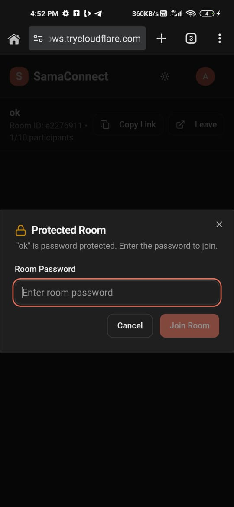
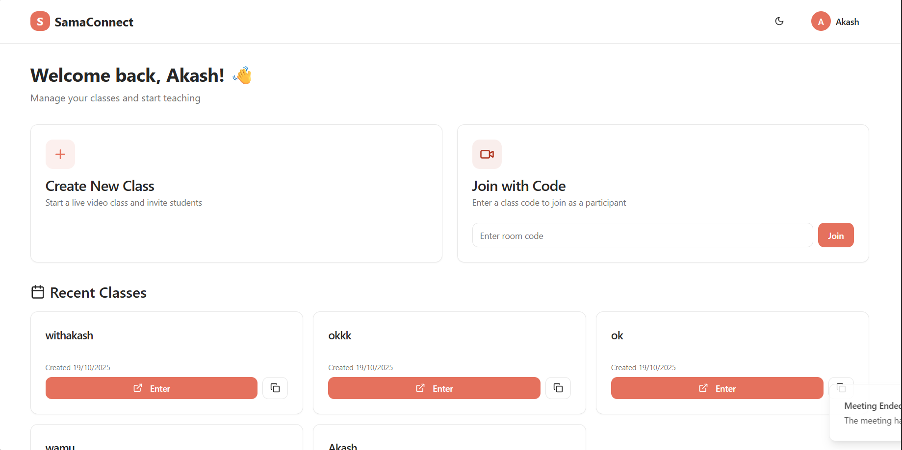
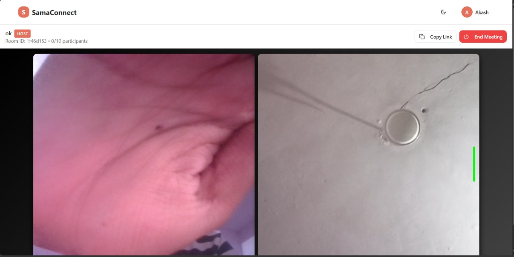

# SamaConnect — Minimal MVP

Lightweight full-stack MVP for live, link-based classroom meetings.

Overview
--------
SamaConnect is a small FastAPI + React app that demonstrates the core features of a video-class platform:
- Create a class (room) with title/description and optional password
- Generate a short shareable room link
- Join a room via the link (privacy safe)
- Basic host controls (end meeting) and participant join/leave tracking
- Automatic logging of meetings and attendies**

Tech stack
----------
- Backend: FastAPI (Python)
- Auth: JWT (OAuth2 password flow)
- Database: SQL (Postgres recommended; SQLAlchemy models present)
- Frontend: React + Vite + TypeScript
- Video: MiroTalk SFU embed (server-side creates/generates room id) 
Quick run (development)
-------------------------
Prerequisites: Python 3.12+, Node.js, npm, PostgreSQL (or adapt DB URL)

1. Backend

 - Create and activate a Python venv
 - Install dependencies (pyproject.toml)
 - Copy environment variables (.env) and set DB and JWT secrets
 - Run the FastAPI server (example):

	uvicorn app.app:app --reload --host 0.0.0.0 --port 8000

2. Frontend

 - cd frontend
 - npm install
 - npm run dev

Key files
---------
- `app/app.py` — FastAPI app bootstrap and CORS
- `app/routes/auth_routes.py` — signup, token (login), user profile
- `app/routes/meet_routes.py` — create/join/leave/end room endpoints
- `app/services/meet_service.py` — room lifecycle, MiroTalk embed URL generation
- `app/models/meet_data.py`, `app/models/user_data.py` — DB models (SQLAlchemy)
- `frontend/src/pages/MeetingRoom.tsx` — meeting UI (iframe embed + copy/share link)

Important API endpoints
-----------------------
- POST /signup — register user
- POST /token — obtain JWT (OAuth2 password flow)
- POST /meet/room/create — create a new room (returns room_id, embed_url)
- GET /meet/room/{room_id} — fetch room metadata
- POST /meet/room/{room_id}/join — join a room (returns embed_url)
- POST /meet/room/{room_id}/leave — leave a room
- POST /meet/room/{room_id}/end — end a meeting (host only)

Database (summary)
------------------
- User / Auth tables: `auth_data`, `user_data` (Auth holds username, email, hashed password; User holds profile fields)
- Meet table: `meet_record` stores room_id (short id), host_id, server_room_id (mirotalk), title, description, password (simple), participants (JSON list), timestamps, is_active flag

Notes, limitations, and next steps
---------------------------------
- Passwords are stored in the DB as non-hashed strings for rooms (simple MVP); user passwords are hashed.
- Video uses MiroTalk SFU via an iframe embed — simple and quick to integrate. For a full custom WebRTC experience consider PeerJS/own SFU or 3rd-party SDKs (Agora, Daily.co).
- Deployment: configured for local dev; for AWS deploy consider containerizing backend and frontend and using managed Postgres + HTTPS + environment secrets.
- Missing pieces for production: email verification, rate limiting, stronger password handling for room passwords, tests, and CI/CD.

How this satisfies the interview assignment
-----------------------------------------
- Link-based access: short `room_id` and `/room/{room_id}` join flow implemented.
- Live video: MiroTalk SFU embed enables multi-user audio/video quickly.
- Auth: JWT-based login/signup exists; join can be used with or without auth depending on front-end gating.
- Class management: create, list (services include get_active_rooms), join/leave/end implemented.

If you want, I can:
- Trim this README further, or convert it to a one-page cheatsheet
- Add a quick docker-compose for local Postgres + backend + frontend
- Add short deploy steps for AWS (Elastic Beanstalk / ECS) or a single-file Dockerfile

Contact
-------
This README was generated from the project source. Ask for edits or additional deployment/docs and I'll update it.

Docker (local)
--------------
A docker-compose file is provided to run Postgres + backend + frontend for local development.

1. Copy the example env and customize secrets:

	copy .env.example .env

2. Build and start services:

	docker-compose up --build

3. Useful notes:
- Backend is available at http://localhost:8000 (FastAPI + Uvicorn)
- Frontend (Vite dev server) is available at http://localhost:5173
- Postgres listens on the host port 5432 by default
- To create DB tables quickly, exec into the backend container and run a small script:

	docker-compose exec backend sh
	python -c "from app.services.db import Base, engine; Base.metadata.create_all(bind=engine); print('tables created')"

4. Stop services:

	docker-compose down

Adjust `.env` values if you need to change DB credentials or JWT secrets. For production, build a production-ready frontend image and remove `--reload` from the backend command.

Screenshots
-----------
Below are a few screenshots of the product UI. Files are stored in the project `src/` directory.

1. Dashboard (mobile)

2. Create / Join UI (mobile)

3. Desktop view 1

4. Desktop view 2

